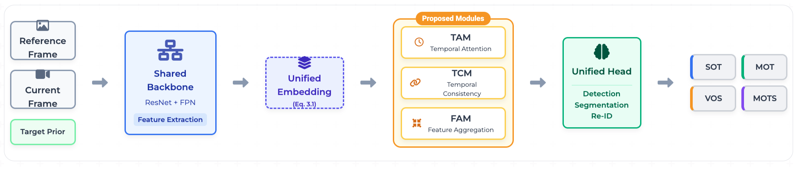
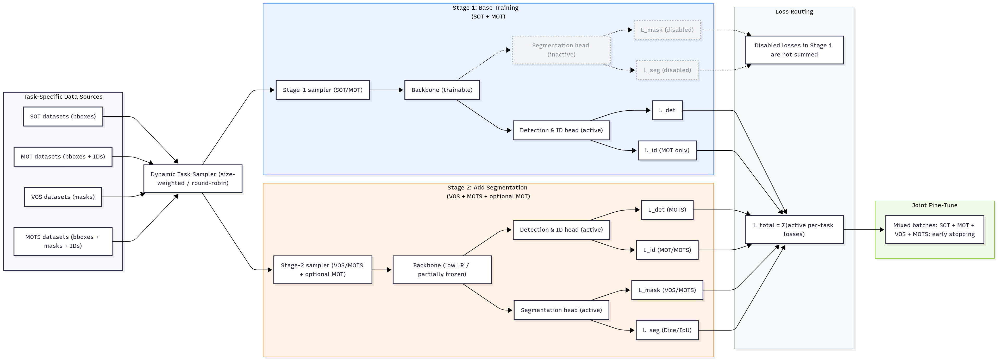
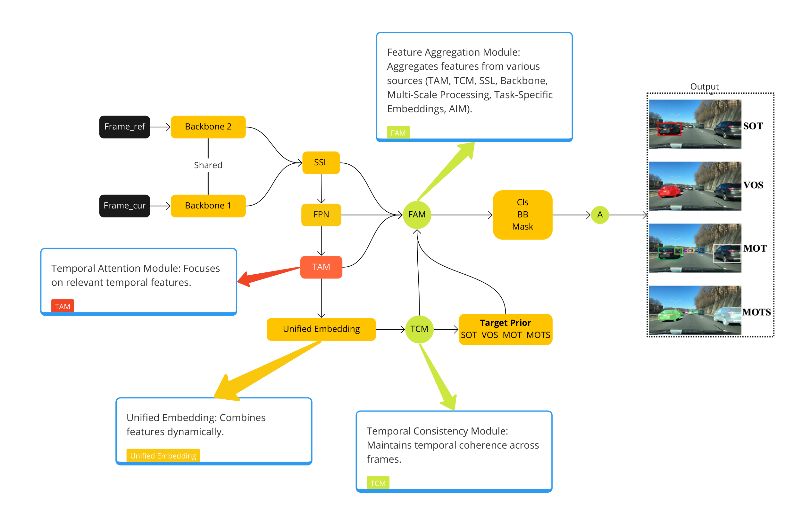

# SSF4VSU: A Self-Supervised Synergetic Framework for Visual Scene Understanding

Official implementation of **SSF4VSU**, a unified framework for **Visual Scene Understanding** across:
- **Single Object Tracking (SOT)**
- **Multi-Object Tracking (MOT)**
- **Video Object Segmentation (VOS)**
- **Multi-Object Tracking & Segmentation (MOTS)**

The design and training methodology are described in our [paper](https://doi.org/10.1109/ACCESS.2025.3634778): shared backbone + FPN, unified embedding with **target prior**, **TAM** and **TCM**, **Feature Aggregation Module (FAM)**, and **two-stage training** with task-conditioned loss routing.

---

## Features

- **Unified backbone + FPN**: Shared ResNet backbone with Feature Pyramid Network (P3, P4, P5, P6) for multi-scale features.
- **Unified embedding**: $U = F_{cur} + \alpha P$ (broadcast addition of target prior $P$). For SOT/VOS, $P$ is the initial mask or bbox; for MOT/MOTS, $P$ is neutral (zeros) or previous predictions.
- **Temporal Attention Module (TAM)**: Q/K/V cross-attention between current and reference frame.
- **Temporal Consistency Module (TCM)**: Embedding-level consistency loss across consecutive frames.
- **Feature Aggregation Module (FAM)**: Fuses TAM output with backbone/FPN features before the heads.
- **Unified heads**: Single detection head (SOT/MOT) and segmentation head (VOS/MOTS).
- **Self-supervised learning (SSL)**: Contrastive (InfoNCE-style) and TCM; optional refinement loop.
- **Two-stage training**: Stage 1 — SOT+MOT (detection only, ~50 epochs); Stage 2 — VOS+MOTS (segmentation, ~20 epochs); then joint fine-tune (~5 epochs). Warm-up + multi-step LR decay.
- **Input resolution**: 640×360 (default) or 1280×720; ImageNet normalization.
- **Evaluation**: LaSOT, TrackingNet (SOT); MOT17, BDD100K (MOT); DAVIS2016/2017 (VOS); MOTS20, BDD100K MOTS (MOTS).

### Key equations

Unified embedding (target prior broadcast addition):

$$U_{ijc} = F_{cur,\,ijc} + \alpha \, P_{ij}$$

Total multi-task loss:

$$L_{total} = \lambda_{det} L_{det} + \lambda_{mask} L_{mask} + \lambda_{SSL} L_{SSL} + \lambda_{TCM} L_{TCM}$$

Temporal Attention Module (TAM), with $Q$ from current frame and $K,V$ from reference:

$$A = \text{softmax}\left(\frac{QK^T}{\sqrt{d}}\right), \qquad F^{att}_t = A \, V$$

Temporal Consistency Module (TCM), embedding consistency across consecutive frames:

$$\mathcal{L}_{TCM} = \frac{1}{N}\sum_{i=1}^{N} \left\| \mathbf{z}_t^{(i)} - \mathbf{z}_{t-1}^{(i)} \right\|^2$$

---

## Overview

SSF4VSU is a **single model** that handles four visual scene understanding tasks (SOT, MOT, VOS, MOTS) via a shared backbone, unified embedding with target prior, temporal attention (TAM) and consistency (TCM), and task-specific heads. Training follows a **two-stage pipeline**: Stage 1 trains on SOT and MOT (detection only); Stage 2 adds VOS and MOTS (segmentation), then a short joint fine-tuning phase.



**Methodology (two-stage training):**



**Proposed methodology:**



*[PDF](docs/architecture/methodology-diagram.pdf)*

**Architecture:** See [docs/architecture/](docs/architecture/) for block diagram, backbone+FPN, unified embedding, TAM, unified heads, and SSL strategies.

---

## Project structure

Run all commands from the **repository root** (where `main.py` lives):

```
ssf4vsu/
├── README.md
├── RESULTS.md      # Full comparison tables, baselines, ablation studies
├── LICENSE
├── requirements.txt
├── .gitignore
├── main.py         # Entry point: train / eval
├── model.py        # Backbone, FPN, UnifiedEmbedding, TAM, TCM, FAM, heads
├── train.py        # Two-stage training, warm-up, multi-step decay
├── losses.py       # Task-conditional L_det, L_mask, L_SSL, L_TCM
├── datasets.py     # MultiTaskDataset (target_prior, task_type, resolution)
├── evaluate.py     # SOT/MOT/VOS/MOTS metrics
├── utils.py        # Checkpoints, logging
├── baselines.py    # Wrappers for SOTA baselines
├── docs/           # Figures and documentation
│   ├── architecture/   # Pipeline, block diagram, TAM, heads, SSL
│   ├── results/        # Result graphs (LaSOT, MOT17, BDD100K, DAVIS, MOTS)
│   └── ablation/       # Ablation bar chart, heatmap (optional)
├── data/           # Datasets (gitignored; see Dataset preparation)
└── checkpoints/    # Saved models (gitignored)
```

---

## Dataset preparation

Per-task folders under `data/` (or a single combined root). Each sequence folder contains frames and `annots.txt`:

```
data/
├── LaSOT/
│   └── video1/
│       ├── 000001.jpg, 000002.jpg, ...
│       └── annots.txt
├── TrackingNet/
├── MOT17/
├── BDD100K/
├── DAVIS2016/
├── DAVIS2017/
├── MOTS20/
└── BDD100K-MOTS/
```

`annots.txt` (comma-separated):

```
frame_idx, x, y, w, h, label_id, mask_path(optional)
```

---

## Training (two-stage)

From the **repo root** (after `pip install -r requirements.txt`):

Single root (all tasks in one tree; task inferred from structure or default SOT):

```bash
python main.py --mode train --checkpoint ./checkpoints/ssf4vsu_best.pth
```

With per-task roots (recommended for correct task proportions ~60% MOT, 25% SOT, 10% VOS, 5% MOTS):

```bash
python main.py --mode train --checkpoint ./checkpoints/ssf4vsu_best.pth \
  --roots_by_task "SOT:./data/LaSOT,MOT:./data/MOT17,VOS:./data/DAVIS2017,MOTS:./data/MOTS20"
```

Default config in code: resolution 640×360, Stage 1 = 50 epochs, Stage 2 = 20 epochs, fine-tune = 5 epochs, warm-up = 5 epochs, AdamW, weight decay 1e-4, gradient clipping 5.0.

---

## Evaluation

From the **repo root**. Frames and target prior are loaded from the dataset; resolution matches training (default 640×360).

```bash
# Single Object Tracking
python main.py --mode eval --task SOT --checkpoint ./checkpoints/ssf4vsu_best.pth --data ./data/LaSOT/

# Multi-Object Tracking
python main.py --mode eval --task MOT --checkpoint ./checkpoints/ssf4vsu_best.pth --data ./data/MOT17/

# Video Object Segmentation
python main.py --mode eval --task VOS --checkpoint ./checkpoints/ssf4vsu_best.pth --data ./data/DAVIS2017/

# MOTS
python main.py --mode eval --task MOTS --checkpoint ./checkpoints/ssf4vsu_best.pth --data ./data/MOTS20/
```

Optional resolution (e.g. 1280×720):

```bash
python main.py --mode eval --task VOS --checkpoint ./checkpoints/ssf4vsu_best.pth --data ./data/DAVIS2017/ --resolution 1280,720
```

---

## Metrics

- **SOT**: Success (AUC), Precision@20, Normalized Precision  
- **MOT**: MOTA, IDF1, FP, FN, ID switches  
- **VOS**: Jaccard (J), F-measure (F), J&F  
- **MOTS**: sMOTSA, MOTSA, MOTSP, IDF1  

---

## 📊 Results

Benchmark results (single model, no task-specific tuning). Full comparison tables with baselines and ablation studies are in [RESULTS.md](RESULTS.md). Result plots are under [docs/results/](docs/results/).

| Task | Dataset | Metric | SSF4VSU |
|:-----|:-------|:-------|--------:|
| **SOT** | LaSOT | AUC / Prec@20 | **71.3** / **77.8** |
| **SOT** | TrackingNet | AUC / Prec@20 | **84.5** / **83.0** |
| **MOT** | MOT17 | MOTA / IDF1 | **81.9** / **80.3** |
| **MOT** | BDD100K | mMOTSA / mIDF1 | **43.5** / **57.0** |
| **VOS** | DAVIS-2016 | J&F | **93.3** |
| **VOS** | DAVIS-2017 | J&F | **89.0** |
| **MOTS** | MOTS20 | sMOTSA / IDF1 | **69.0** / **70.5** |
| **MOTS** | BDD100K MOTS | mMOTSA / mIDF1 | **31.2** / **46.0** |

> **Note:** Same checkpoint for all tasks; input resolution 640×360 or 1280×720; online inference. See [RESULTS.md](RESULTS.md) for full comparison tables and ablation studies.

---

## Baselines

Lightweight wrappers in `baselines.py`: SiamFC, SiamRPN++, TransT, Unicorn, OmniTracker. For exact reproduction, use official implementations or pretrained weights.

---

## Requirements

```bash
pip install -r requirements.txt
```

Suggested `requirements.txt`:

```
torch>=1.12.0
torchvision>=0.13.0
timm>=0.6.7
numpy
scikit-learn
matplotlib
Pillow
```

---

## Citation

```bibtex
@ARTICLE{11258901,
  author={Hassan, Saif and Mujtaba, Ghulam and Ullah, Habib and Imran, Ali Shariq and Soylu, Ahmet and Ullah, Mohib},
  journal={IEEE Access}, 
  title={SSF4VSU: A Self-Supervised Synergetic Framework for Visual Scene Understanding}, 
  year={2025},
  volume={13},
  number={},
  pages={197544-197561},
  keywords={Videos;Visualization;Object segmentation;Feature extraction;Computer architecture;Transformers;Pipelines;Cognition;Training;Target tracking;Visual scene understanding;single/multi-object tracking;video object segmentation;temporal consistency;self-supervised learning;multi-task learning},
  doi={10.1109/ACCESS.2025.3634778}}

```

---

## License

This project is licensed under the MIT License — see the [LICENSE](LICENSE) file for details.

---

## Acknowledgements

This project builds on prior work in tracking (SiamFC, SiamRPN++, TransT, Unicorn, OmniTracker), segmentation (STM, STCN, XMem), MOT (CenterTrack, FairMOT, ByteTrack), and MOTS (TrackR-CNN, PCAN). We thank the authors for making their research publicly available.
